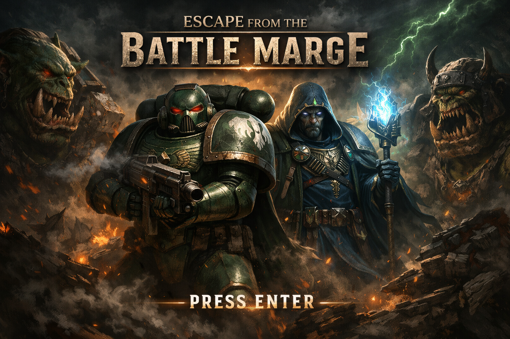
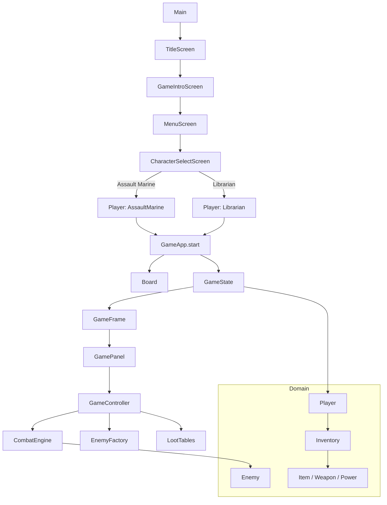

<p align="center">
  
</p>

Jeu Java (Swing) inspiré de l’univers Warhammer 40K : vous incarnez un Space Marine Dark Angels qui doit traverser une Battle Barge infestée d’Orks avant l’implosion.

## Aperçu

- **Type** : jeu solo en Java
- **Interface** : Swing (écrans titre, intro, sélection de personnage, jeu)
- **Point d’entrée** : `src/fr/campus/escapebattlebarge/app/Main.java`
- **Classes jouables** : Assault Marine, Librarian

## Architecture du projet

- `app/` : démarrage de l’application
- `ui/` : écrans et composants graphiques
- `game/` : logique de jeu (plateau, état, contrôleur, combat, génération d’ennemis)
- `domain/` : modèles métier (joueur, ennemis, objets, inventaire, pouvoirs)
- `resources/` : assets (audio, images, manifeste)

## Schéma Mermaid



  ## Schéma Mermaid (version 2 - classDiagram)

  ```mermaid
  classDiagram
    class Player {
      <<abstract>>
      -name : String
      -playerClass : PlayerClass
      -hp : int
      -maxHp : int
      -position : int
      -inventory : Inventory
      +getName() String
      +getHp() int
      +heal(amount:int) void
      +damage(dmg:int) void
    }

    class AssaultMarine
    class Librarian

    class Enemy {
      -name : String
      -hp : int
      -minDmg : int
      -maxDmg : int
      -boss : boolean
      +isAlive() boolean
      +damage(dmg:int) void
    }

    class OrkBoy
    class Warboss

    class Inventory {
      -equippedWeapon : Weapon
      -consumables : List~Consumable~
      -stash : List~Item~
      +equipWeapon(weapon:Weapon) void
      +addConsumable(c:Consumable) boolean
      +addToStash(item:Item) void
    }

    class Item {
      <<abstract>>
      -name : String
      -type : ItemType
      +getName() String
      +getType() ItemType
    }

    class Weapon {
      -minDmg : int
      -maxDmg : int
    }

    class Power {
      -minDmg : int
      -maxDmg : int
    }

    class Consumable {
      -healAmount : int
    }

    Player <|-- AssaultMarine
    Player <|-- Librarian

    Item <|-- Weapon
    Item <|-- Power
    Item <|-- Consumable

    Player *-- Inventory
    Inventory o-- Weapon : equipped
    Inventory o-- Consumable : carries
    Inventory o-- Item : stash
  ```

## Lancer le projet

### Option 1 — IntelliJ IDEA

1. Ouvrir le dossier du projet.
2. Vérifier que le SDK Java est configuré.
3. Exécuter `Main`.

### Option 2 — Ligne de commande (Linux/macOS)

Depuis la racine du projet :

```bash
mkdir -p out
javac -d out $(find src -name "*.java")
java -cp out fr.campus.escapebattlebarge.app.Main
```

## Arborescence simplifiée

```text
src/
  fr/campus/escapebattlebarge/
    app/
    domain/
    game/
    ui/
  resources/
```

## État du projet

Le projet contient à la fois des éléments console (ex: `game/Game.java`, `ui/Menu.java`) et une version graphique Swing utilisée par le point d’entrée actuel.
