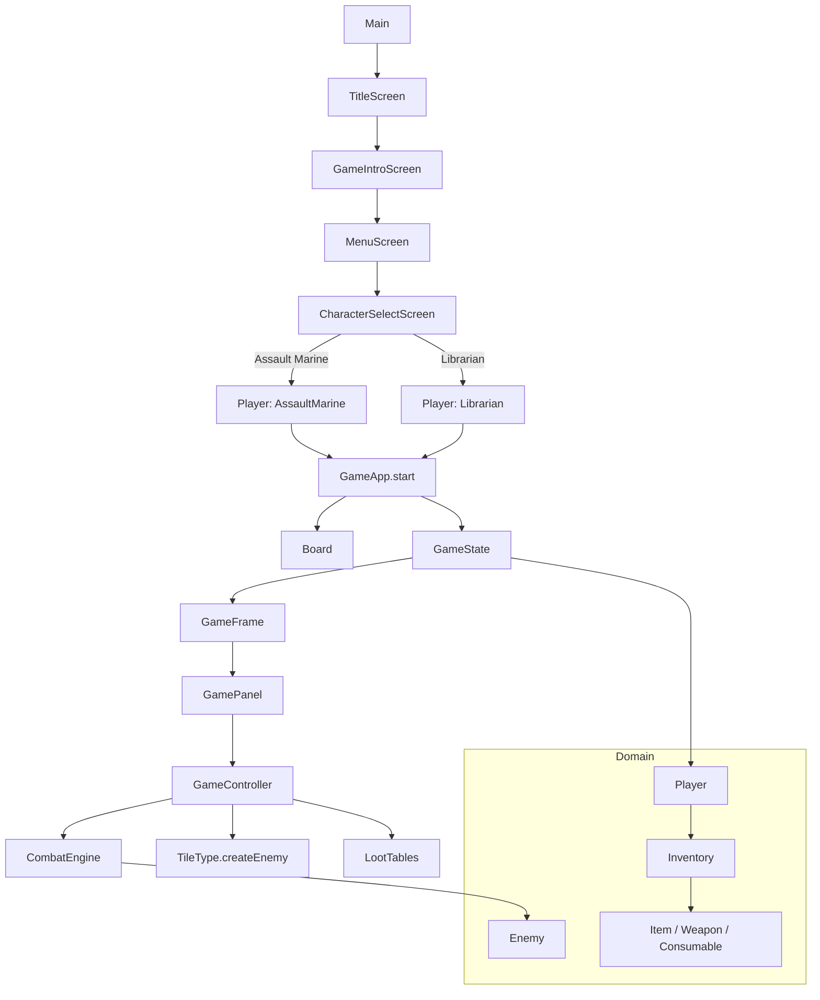

# Escape from the Battle Barge

Jeu Java (Swing) inspiré de l’univers Warhammer 40K : vous incarnez un Space Marine Dark Angels qui doit traverser une Battle Barge infestée d’Orks avant l’implosion.

## Aperçu

- **Type** : jeu solo en Java
- **Interface** : Swing (écrans titre, intro, sélection de personnage, jeu)
- **Point d’entrée** : `src/fr/campus/escapebattlebarge/Main.java`
- **Classes jouables** : Assault Marine, Librarian

## Architecture du projet

- `app/` : démarrage de l’application
- `ui/` : écrans et composants graphiques
- `game/` : logique de jeu (plateau, état, contrôleur, combat, génération d’ennemis)
- `domain/` : modèles métier (joueur, ennemis, objets, inventaire)
- `resources/` : assets (audio, images, manifeste)

## Schéma Mermaid



## Lancer le projet

### Option 1 — IntelliJ IDEA

1. Ouvrir le dossier du projet.
2. Vérifier que le SDK Java est configuré.
3. Exécuter `Main`.

### Option 2 — Ligne de commande (Linux/macOS)

Depuis la racine du projet :

```bash
mkdir -p out
javac -d out $(find src -name "*.java")
java -cp out fr.campus.escapebattlebarge.app.Main
```

## Arborescence simplifiée

```text
src/
  fr/campus/escapebattlebarge/
    app/
    domain/
    game/
    ui/
  resources/
```

## État du projet

Le projet est orienté interface graphique Swing (écrans, contrôleurs, rendu en temps réel).
